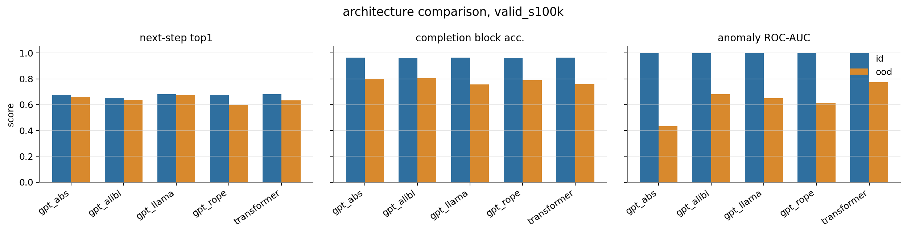
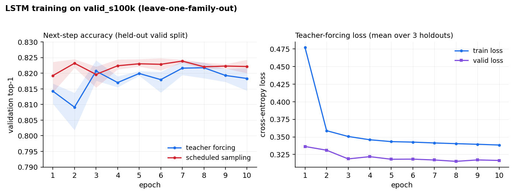

# Experiment report — Industrial AI (Infineon)

## Team

- **Marcin Kostrzewa** — AI Engineer
- **Michal Furgala** — AI Engineer
- **Lukasz Lenkiewicz** — AI Engineer

**Track:** Industrial AI (Infineon) — learning process logic from semiconductor fabrication sequences.

---

## TL;DR

We built a synthetic process-grammar generator and trained compact sequence decoders to model MOSFET, IGBT, and IC fabrication flows, scoring them on next-step prediction, completion, anomaly detection, and a leave-one-family-out OOD split. In distribution, a tuned 5-gram, LSTM, and GPT-style decoder all land near 0.69 top-1 next-step accuracy and near-perfect top-3. Likelihood-based anomaly detection is almost solved in distribution, but the OOD case is where the problem becomes interesting: the same ID-calibrated threshold collapses to all-anomaly predictions on the held-out family, so F1 sits at the 0.667 all-positive baseline even when ROC-AUC still shows useful ranking signal.

---

## Problem

We model the process grammar behind MOSFET, IGBT, and IC fabrication flows (≈198-step vocabulary, ~115–150 steps/sequence, shared backbone + family-specific steps). Three scored tasks plus an OOD differentiator:

- **Task 1 — Next step:** Top-1/3/5 accuracy, MRR.
- **Task 2 — Completion:** exact match, normalized edit distance, token accuracy, and block accuracy.
- **Task 3 — Anomaly:** accuracy, precision/recall/F1, ROC-AUC, rule-attribution accuracy.
- **Task 4 — OOD:** leave-one-family-out — train on two families, evaluate on the unseen third.

---

## Approach

We used a small pipeline:

- Generate more valid process flows from the provided grammar, then evaluate on
  fixed Industrial variant prefixes and fixed anomaly sets. This should give the
  model more structure than the three starter families alone while keeping
  evaluation reproducible.
- Train compact GPT-style decoders for next-step prediction, then reuse the same
  conditional distribution for greedy completion and likelihood anomaly scoring.
- Run an architecture sweep where ALiBi was the strongest signal for OOD
  completion, then keep the main pipeline focused on the fixed holdout protocol.
- Use the process-rule validator during fine tuning where useful, so generated
  continuations are scored on process validity and token likelihood.

---

## Ideas and approaches

Beyond plain next-token training, we tried three ways to inject process knowledge
into the models.

**Phase loss.** Every fabrication step belongs to a coarse process phase
(logistics, clean, lithography, etch, implant, deposition, CMP, via, metal,
passivation, test, shipment). The auxiliary phase loss encourages the decoder to
put probability mass on steps from the correct next phase, not only on the exact
next token. The intended effect is smoother generalization when several concrete
steps are valid alternatives inside the same process block. In the final sweep,
`phase_loss_weight = 0.1` gave small ID gains but hurt OOD next-step and anomaly
AUC, so the final submission uses phase loss off.

**DPO preference tuning.** We use the process-rule validator to create preference
pairs. For a valid training sequence, we cut a prefix, keep the true suffix as
the chosen continuation, and create a rejected continuation by introducing a
targeted rule violation or a valid-but-mismatched suffix. DPO then compares the
policy against a frozen SFT reference and rewards the policy for assigning a
higher log-probability margin to the chosen suffix than to the rejected one. A
small SFT term keeps the model anchored to the original continuation. This is how
we turn the symbolic validator into a learning signal without hand-writing a
decoder.

**Neurosymbolic masking and shaping.** At decode time, we can ask the validator
whether a candidate next step would immediately violate a process rule. The hard
variant masks invalid tokens out of the top-k distribution. The soft variant
keeps them available but penalizes them. This is attractive because it is cheap,
model-agnostic, and safe for known rules. In our next-step experiments, the GPT's
top candidates were already mostly rule-compliant, so masking changed almost
nothing; it may matter more for long free-running completions where errors
compound.

**Unknown-token regularization.** During GPT training we sometimes replace the
family token with `<FAMILY_UNKNOWN>` and some prefix steps with `<UNK_STEP>`.
This is meant to reduce brittle dependence on family labels and exact local
tokens. It helped the anomaly-ranking story but also appears to weaken sharp
OOD next-step prediction, where n-grams remain very strong.

---

## 1. Classic & LSTM baselines

We started with simple baselines on the shared split files from
`scripts/create_dataset_splits.py`. These are the reference numbers we compare
the neural models against.

### 1.1 Classic baselines

The classical side is intentionally small: n-gram and VLMC models trained on the
same generated split files as the neural models. We search over n-gram orders
`3/5/7` and smoothing values. The tuned 5-gram is the main ID reference, while
the 7-gram is strongest for OOD next-step. Fixed holdout numbers are reported
alongside the neural models in section 3.4.

| Model | View | Task 1 Top-1 | Top-3 | MRR | Task 2 ExactMatch | Norm. edit dist | Task 3 F1 | ROC-AUC |
|---|---|---:|---:|---:|---:|---:|---:|---:|
| 5-gram (tuned) | ID | 0.690 | 0.996 | 0.843 | 0.004 | 0.227 | 1.000 | 1.000 |
| 7-gram (tuned) | OOD | 0.668 | 0.980 | 0.823 | 0.000 | 0.394 | 0.667 | 0.787 |

### 1.2 LSTM baseline

We then trained LSTM baselines on the same fixed holdout setup used for the main
`valid_s100k` comparison. This was a quick check before spending more compute on
larger transformer runs.

We compared standard teacher forcing with scheduled sampling. Teacher forcing
always feeds the true previous token during training. Scheduled sampling
sometimes feeds the model's own previous prediction, which should make
free-running completion less brittle.

It did not help much here. Scheduled sampling slightly improves ID completion
edit distance and token accuracy, and has slightly higher OOD top-1 next-step,
but teacher forcing is better on ID next-step, ID anomaly, and OOD completion.
OOD anomaly still collapses to the all-positive thresholded baseline for both
LSTM variants.

| Variant | View | Task 1 Top-1 | Top-3 | MRR | Task 2 ExactMatch | Norm. edit dist | Token acc | Task 3 F1 | ROC-AUC |
|---|---|---:|---:|---:|---:|---:|---:|---:|---:|
| Teacher forcing | ID | 0.689 | 0.997 | 0.842 | 0.003 | 0.237 | 0.425 | 0.978 | 0.998 |
| Scheduled sampling | ID | 0.687 | 0.997 | 0.840 | 0.004 | 0.222 | 0.435 | 0.941 | 0.985 |
| Teacher forcing | OOD | 0.657 | 0.981 | 0.817 | 0.000 | 0.467 | 0.203 | 0.667 | 0.770 |
| Scheduled sampling | OOD | 0.665 | 0.977 | 0.818 | 0.000 | 0.526 | 0.179 | 0.667 | 0.719 |

We also tested masked completion decoding for the LSTMs, where the decoder avoids
invalid output tokens during completion. This is completion-only, so it does not
change next-step or anomaly metrics. It helps teacher-forcing ID edit distance
slightly but hurts OOD completion, so the main comparison table uses the
unmasked teacher-forcing LSTM.

| Completion decoder | View | ExactMatch | Norm. edit dist | Token acc | Block acc |
|---|---|---:|---:|---:|---:|
| Teacher forcing | ID | 0.003 | 0.237 | 0.425 | 0.702 |
| Teacher forcing + mask | ID | 0.003 | 0.225 | 0.430 | 0.702 |
| Scheduled sampling | ID | 0.004 | 0.222 | 0.435 | 0.690 |
| Scheduled sampling + mask | ID | 0.004 | 0.222 | 0.435 | 0.690 |
| Teacher forcing | OOD | 0.000 | 0.467 | 0.203 | 0.516 |
| Teacher forcing + mask | OOD | 0.000 | 0.498 | 0.172 | 0.467 |
| Scheduled sampling | OOD | 0.000 | 0.526 | 0.179 | 0.389 |
| Scheduled sampling + mask | OOD | 0.000 | 0.526 | 0.179 | 0.387 |

---

## 2. Data preparation

The reported experiments use three data sources.

| Data | Where | Purpose |
|---|---|---|
| Generated valid training data | `data/generated/valid_s005k`, `valid_s020k`, `valid_s100k` | Main training data for n-gram, VLMC, LSTM, and GPT. Generated with the organizer grammar in `data/industrial/generate_sequences.py`. |
| Fixed Industrial eval sets | `data/eval/<dataset>/holdout_<family>/{id,ood,calibration}` | Shared evaluation protocol. Task 1 and Task 2 inputs come from the organizer `*_variants.csv` files. Task 3 uses generated valid/invalid anomaly cases with the same calibration split for thresholds. |
| Augmented rule-valid SFT data | `data/generated/augmented_s050k/raw.csv` | Extra GPT training data used by `gpt_phase_augmented`, phase-loss experiments, and DPO initialization. |

The important point is that training and evaluation are separated. Models train
on generated rule-valid sequences. Task 1 and Task 2 are evaluated on fixed
Industrial variant prefixes. Task 3 thresholds are tuned once on the fixed
calibration split, then reused for ID and OOD anomaly evaluation.

---

## 3. Model training

### 3.1 Architectures compared

We compared five transformer variants on `valid_s100k`. Each run trained on two
families and evaluated on both ID samples and the unseen third family. The table
averages `holdout_mosfet`, `holdout_igbt`, and `holdout_ic` from
`architecture_metrics/valid_s100k/` and `arch_compare.json`.



| Architecture | Position scheme | ID next-step | OOD next-step | ID completion | OOD completion | ID anomaly AUC | OOD anomaly AUC |
|---|---|---:|---:|---:|---:|---:|---:|
| GPT-absolute | learned absolute | 0.675 | 0.660 | 0.965 | 0.799 | 1.000 | 0.433 |
| GPT-ALiBi | linear attention bias | 0.652 | 0.635 | 0.963 | 0.806 | 0.999 | 0.680 |
| GPT-LLaMA-style | rotary | 0.681 | 0.672 | 0.964 | 0.756 | 1.000 | 0.650 |
| GPT-RoPE | rotary | 0.675 | 0.600 | 0.961 | 0.791 | 1.000 | 0.612 |
| Causal transformer | learned absolute | 0.681 | 0.633 | 0.963 | 0.759 | 1.000 | 0.773 |

The architecture sweep is the reason ALiBi is part of our model-selection story.
The ID scores do not separate the models much: completion is around 0.96 block
accuracy and anomaly AUC is almost perfect for every variant. The useful signal
is OOD. GPT-ALiBi has the best OOD completion score at 0.806, which matters most
for generating the remaining process flow from a prefix. It also keeps anomaly
separation reasonable at 0.680 OOD AUC, far above GPT-absolute and RoPE, though
below the causal transformer.

That tradeoff matched the submission goal. We needed one model family that can
rank the next step, complete sequences, and produce likelihood scores for anomaly
detection. ALiBi gives a simple distance bias instead of relying only on learned
absolute positions, so it is the cleanest architecture argument for variable
prefix lengths and held-out-family generation. The causal transformer is better
if we optimize only for OOD anomaly AUC, but GPT-ALiBi is the stronger
completion-focused choice in this sweep.

**Naming.** From here on, rows labelled `gpt_bare`, `gpt_phase_augmented`,
`gpt_phase_augmented_pl01`, and `gpt_dpo_10ep_100k` are successive stages of the
same GPT decoder pipeline under the fixed eval protocol. `bare` means the base
next-step model before augmentation or preference tuning.

### 3.2 Training setup

- **Objective:** next-token cross-entropy with label smoothing 0.02, padding ignored. We also tested an auxiliary next-phase loss (`phase_loss_weight = 0.1`) against the default phase-loss-off setting (`phase_loss_weight = 0`).
- **Data / splits:** `valid_s100k` is the generator output of 100k rule-valid sequences per family (MOSFET, IGBT, IC). Splits are leave-one-family-out: train on two families, hold out the third. ID test draws from the two trained families, OOD test is the held-out family. The `gpt_bare` reference trains on a 20k subsample.
- **Model:** GPT decoder with `d_model 256`, 4 layers, 8 heads, context 256, vocab about 206, about 3.3M parameters for the augmented/final runs. The `gpt_bare` reference is smaller (`d_model 128`, 3 layers, context 192, about 0.65M).
- **Optimizer / schedule:** AdamW, lr `3e-4`, weight decay 0.05, betas `(0.9, 0.95)`, linear warmup over 5% of steps then cosine decay to `0.1x`, gradient clip 1.0. Batch size 128, up to 30 epochs, early stop with patience 5, seed 1729.
- **Robustness regularization:** for augmented/final GPT runs we randomly replace the family token with `<FAMILY_UNKNOWN>` and replace some prefix steps with `<UNK_STEP>` during training. This forces the decoder to rely less on memorized family identity and exact local tokens. The final-submission wrapper uses `family_dropout = 0.25` and `step_dropout = 0.05`; holdout SFT/DPO runs use the same idea with their own tuned defaults.
- **Hardware:** CINECA Leonardo, one A100 64GB per run on the `boost_usr_prod` partition. The three holdouts run as a job array.
- **Slurm:** `slurm/train_lstm.sbatch`, `slurm/train_models.sbatch`, `slurm/run_holdout_gpt_alibi.sbatch` (and `run_holdout_gpt_alibi_large.sbatch` for the larger config).

### 3.3 Learning curves

The architecture sweep figure is the bar chart in section 3.1. For per-epoch curves we have the LSTM training histories on `valid_s100k`, averaged over the three holdouts below.



The teacher-forcing LSTM converges fast. Train loss drops from 0.477 to 0.338 over 10 epochs while validation loss settles between 0.315 and 0.336, and internal validation top-1 reaches about 0.82 by epoch 3 and then flattens (peak 0.822 at epoch 8). These learning-curve values come from sampled next-token validation batches during training, not from the fixed Industrial eval prefixes used in the main tables. Validation loss sits slightly below train loss because the training loss carries dropout and label smoothing that the eval pass does not. The left panel puts teacher forcing against scheduled sampling on the same validation top-1 axis: the two track each other within a percentage point. On the fixed eval sets, teacher forcing is slightly better for ID next-step and anomaly, while scheduled sampling is only marginally better on OOD next-step and ID edit distance (section 1.2). The GPT runs were not exported as committed loss-vs-step figures beyond the architecture comparison chart.

On process validity: the ground-truth signal is the organizer rule checker
`validate_sequence`. Some early completion experiments tracked explicit
process-validity rate, but the fixed metric dumps used for the main tables do
not store this field consistently across GPT, DPO, LSTM, and classic baselines.
We therefore avoid quoting process-validity rates in the main result tables and
use the official completion/anomaly metrics instead.

### 3.4 Trained-model results (baseline vs. trained, same inputs)

All rows come from `resultsdirectory/outputs/metrics/valid_s100k/`, averaged over the three holdouts. The classic reference is the tuned 5-gram, the LSTM row is the unmasked teacher-forcing run, and the GPT is the `gpt_bare` next-step decoder trained on `valid_s100k` before augmentation or preference tuning. The architecture comparison in 3.1 is a separate experiment on a different harness (see the caveat there), so it is not mixed into this table.

| Model | View | Top-1 | Top-3 | MRR | Compl. ExactMatch | Anomaly F1 | ROC-AUC |
|---|---|---:|---:|---:|---:|---:|---:|
| 5-gram (tuned) | ID | 0.690 | 0.996 | 0.843 | 0.004 | 1.000 | 1.000 |
| LSTM (teacher forcing) | ID | 0.689 | 0.997 | 0.842 | 0.003 | 0.978 | 0.998 |
| GPT decoder (bare) | ID | 0.687 | 0.996 | 0.841 | 0.004 | 0.944 | 0.985 |
| 5-gram (tuned) | OOD | 0.663 | 0.980 | 0.821 | 0.000 | 0.667 | 0.769 |
| LSTM (teacher forcing) | OOD | 0.657 | 0.981 | 0.817 | 0.000 | 0.667 | 0.770 |
| GPT decoder (bare) | OOD | 0.667 | 0.979 | 0.823 | 0.000 | 0.667 | 0.765 |

> ID to OOD drop (the Task-4 story): next-step prediction barely moves between ID and OOD (top-1 stays near 0.66), because local step transitions look similar across families. Anomaly detection is the part that breaks. In distribution every model scores near-perfect ROC-AUC, but on the held-out family the ID-tuned threshold flags almost everything, so F1 collapses to the all-positive baseline (0.667) and threshold-free ROC-AUC drops to about 0.77. This is partly a calibration failure: we tune a single threshold for F1 on the calibration split, and on OOD score distributions that threshold can move to a degenerate operating point where every sample is predicted as one class. The bare GPT decoder and the 5-gram land in the same place on OOD anomaly (AUC 0.765 and 0.769), so the neural model gives no advantage before augmentation. Anomaly F1 depends on both the ID-tuned threshold and the test composition, so ROC-AUC is the fairer cross-model OOD comparison.

### 3.5 Augmentation, phase loss, and DPO

We then moved from the bare 100k GPT to the augmented SFT pipeline. This stage
adds 50k generated rule-valid sequences, applies family-token dropout and step
dropout during training, and keeps the held-out family excluded from weight
updates. We tested the auxiliary phase loss at `0.1`, but it did not improve the
fixed holdout metrics enough to justify using it as the default. The final
submission model therefore uses the phase-loss-off variant.

All rows below come from
`resultsdirectory/outputs/metrics/valid_s100k_augmented_s050k/`, averaged over
the three holdouts. We report only the longer DPO run:
`gpt_dpo_10ep_100k`, trained for 10 epochs on 100k preference pairs.

| Policy | View | Top-1 | Top-3 | MRR | Compl. ExactMatch | Norm. edit dist | Token acc | Anomaly F1 | ROC-AUC |
|---|---|---:|---:|---:|---:|---:|---:|---:|---:|
| SFT augmented, phase loss 0 | ID | 0.689 | 0.997 | 0.842 | 0.004 | 0.226 | 0.430 | 0.936 | 0.981 |
| SFT augmented, phase loss 0.1 | ID | 0.692 | 0.997 | 0.844 | 0.002 | 0.224 | 0.432 | 0.931 | 0.981 |
| DPO 10 epochs / 100k pairs | ID | 0.693 | 0.997 | 0.844 | 0.003 | 0.224 | 0.421 | 0.996 | 1.000 |
| SFT augmented, phase loss 0 | OOD | 0.627 | 0.946 | 0.793 | 0.000 | 0.439 | 0.134 | 0.667 | 0.850 |
| SFT augmented, phase loss 0.1 | OOD | 0.612 | 0.945 | 0.782 | 0.000 | 0.413 | 0.121 | 0.667 | 0.835 |
| DPO 10 epochs / 100k pairs | OOD | 0.618 | 0.947 | 0.783 | 0.000 | 0.415 | 0.134 | 0.667 | 0.822 |

The practical read is mixed. Augmentation is useful for OOD anomaly ranking: the
bare GPT is 0.765 ROC-AUC OOD, while augmented SFT reaches 0.850. Phase loss
0.1 slightly improves ID next-step and edit distance, but hurts OOD next-step
and OOD anomaly AUC. DPO is excellent for ID anomaly calibration (F1 0.936 to
0.996, ROC-AUC 0.981 to about 1.000), but it does not fix the threshold-transfer
failure: OOD F1 remains 0.667 because the tuned threshold still predicts a
single class. The fact that OOD ROC-AUC remains much higher than F1 in some runs
means the likelihood scores still rank valid vs. invalid sequences, but the
F1-selected threshold is the wrong operating point after distribution shift. So
DPO is a good result to show for validator-driven preference tuning, not the
all-task winner.

The other clear tradeoff is Task 1 generalization. On ID next-step, the reported
10-epoch DPO model is the strongest neural row (0.693 top-1), narrowly above the
tuned 5-gram (0.690). On OOD next-step, however, the best results are still the
local-statistics baselines: 7-gram reaches 0.668 top-1 and the bare GPT is 0.667,
while augmented SFT drops to 0.627 and DPO to 0.618. The likely reason is that
family-token dropout, unknown-step regularization, and validity-oriented
fine-tuning help global likelihood/anomaly ranking but distort the sharp local
transition distribution that Task 1 rewards. With more generated data, a larger
decoder, and longer training on all families, we would expect this gap to shrink:
the current neural runs are still small compared with the combinatorial process
space, while the n-gram directly memorizes the local transitions that transfer
well across families.

### 3.6 Neurosymbolic decoding

We tested whether applying the process rules at decoding time changes next-step predictions. Starting from the `gpt_phase_augmented` GPT, we re-rank the next-step distribution two ways (`src/zero_hack/models/neurosymbolic/decoding.py`, driven by `scripts/compare_gpt_neurosymbolic.py`): `ns_hard` masks out tokens that would violate a rule, and `ns_shaped` applies a soft penalty instead of a hard mask. The table is OOD next-step on the held-out family (`outputs/neurosymbolic/valid_s100k_augmented_s050k/holdout_*_ood.jsonl`, 2000 examples each).

| Holdout (OOD) | Decoder | Top-1 | Top-3 | Top-5 | MRR | Top-1 changed |
|---|---|---:|---:|---:|---:|---:|
| ic | bare | 0.5905 | 0.9895 | 0.9975 | 0.7853 | reference |
| ic | ns_hard | 0.5905 | 0.9895 | 0.9975 | 0.7853 | 0 / 2000 |
| ic | ns_shaped | 0.5925 | 0.9895 | 0.9975 | 0.7863 | 6 / 2000 |
| mosfet | bare | 0.6255 | 0.9985 | 1.0000 | 0.8045 | reference |
| mosfet | ns_hard | 0.6255 | 0.9985 | 1.0000 | 0.8045 | 0 / 2000 |
| mosfet | ns_shaped | 0.6255 | 0.9985 | 1.0000 | 0.8045 | 0 / 2000 |
| igbt | bare | 0.6655 | 0.8490 | 0.9885 | 0.7883 | reference |
| igbt | ns_hard | 0.6655 | 0.8490 | 0.9885 | 0.7883 | 0 / 2000 |
| igbt | ns_shaped | 0.6655 | 0.8495 | 0.9885 | 0.7884 | 0 / 2000 |

> **Finding:** decode-time rules do almost nothing here. Hard masking never changes the top-1 token (0 of 2000 on every holdout), because the rule mask does not fire on the model's high-probability candidates. Shaping moves at most 6 of 2000 predictions (IC), a top-1 change of 0.002. The augmented GPT already keeps its top next-step candidates rule-compliant, so the symbolic layer has nothing to correct at this stage. It could still matter for full free-running completion, where errors compound over many steps, which we did not measure here.

---

## How to run it

The full pipeline runs as Slurm jobs on Leonardo. Each `sbatch` wrapper provisions
the environment (`slurm/setup_uv.sh`) and calls the same Python entry points used
locally, so the cluster and laptop paths stay in sync.

```bash
uv sync   # one-time environment setup on the login node

# Data: generate rule-valid sequences, leave-one-family-out splits, eval sets
sbatch slurm/generate_valid_datasets.sbatch     # valid_s005k / valid_s020k / valid_s100k
sbatch slurm/create_dataset_splits.sbatch       # array 0-2: per holdout family
sbatch slurm/make_eval_sets.sbatch              # array 0-2: id / ood / calibration sets

# Classic baselines (n-gram / VLMC search, all three tasks)
sbatch slurm/eval_classic_search.sbatch

# LSTM (teacher forcing vs scheduled sampling)
sbatch slurm/train_lstm.sbatch                  # array 0-1
sbatch slurm/eval_lstm_completion.sbatch        # array 0-1

# Transformer architecture sweep (abs / alibi / rope / llama)
sbatch slurm/run_holdout_gpt_alibi.sbatch       # add slurm/run_holdout_gpt_alibi_large.sbatch for the larger config

# GPT stages: bare GPT, augmented SFT, then 10-epoch DPO
sbatch slurm/train_gpt_bare.sbatch
sbatch slurm/train_gpt_phase_augmented.sbatch
sbatch slurm/train_gpt_dpo.sbatch

# Final all-family model and organizer-format submission files
PHASE_LOSS_WEIGHT=0 METHOD_NAME=final_submission_gpt \
  sbatch slurm/train_final_submission.sbatch
sbatch slurm/predict_final_submission.sbatch
```

Most wrappers accept environment overrides (e.g. `DATASETS=valid_s005k
HOLDOUT_FAMILIES=ic sbatch slurm/run_holdout_gpt_alibi.sbatch`); see the comment
header of each `.sbatch` file for the full list. To run a wrapper off-cluster
(no scheduler), set `RUNNER="" LEONARDO_LOAD_MODULES=0` and invoke it with `bash`
instead of `sbatch`.

See [README.md](README.md) for the full data/eval layout.

---

## What worked / What didn't

- **Worked:** Generating rule-valid sequences at scale (100k per family) with the validator as a backstop. Plain sequence likelihood is a near-perfect in-distribution anomaly detector, both for the 5-gram and GPT decoder (ROC-AUC near 1.0). The fixed leave-one-family-out eval sets give us a clean ID/OOD split. Augmented SFT improves OOD anomaly ranking, and 10-epoch DPO on validity-labeled pairs sharply improves ID anomaly discrimination (AUC 0.981 to about 1.000). For ID next-step, the reported DPO model is competitive with or slightly above the tuned n-gram.
- **Didn't:** OOD next-step and thresholded OOD anomaly detection. For Task 1 on the held-out family, the n-gram and bare GPT remain stronger than the augmented/DPO neural models, which suggests that our fine-tuning over-specialized the local transition distribution. For anomaly detection, the ID-tuned threshold does not transfer to an unseen family, so several runs collapse to predicting every OOD anomaly sample as one class: F1 falls to the all-positive baseline even when ROC-AUC still shows useful ranking. Positional encoding choice barely moved the ID metrics, so there was no clear winner and we picked ALiBi for its OOD completion. Scheduled sampling did not beat teacher forcing at this scale. Exact-match completion stays near zero, since the sequences are long and many continuations are equally valid.

## What we'd do with another 36 hours

The biggest unfinished piece is making the process-rule validator improve OOD
completion rather than only ID anomaly calibration. The checker
`validate_sequence` labels any sequence as valid or not for free, so it can drive
training directly, but the reward has to move generation quality rather than just
separate valid and invalid tails.

**Offline preference optimization (DPO).** Starting from the augmented-data SFT
checkpoint (`gpt_phase_augmented`, the `d_model 256` 4-layer GPT),
`scripts/generate_dpo_pairs.py` builds preference pairs: cut a valid sequence at
a random 25-75% prefix, keep the true continuation as the chosen sample, and
produce a rejected continuation one edit from valid. The mix is 0.9
rule-violating (a targeted `corrupt_steps` break confirmed by
`first_violated_rule`) and 0.1 valid-but-mismatched suffix. The reported DPO run
uses 100k pairs, 10 epochs, DPO temperature 0.1, SFT weight 0.3, lr 5e-6, batch
16, and a frozen reference policy. Prompts come from training families only, so
the held-out family stays unseen. This is a strong ID anomaly result, but not a
final answer to OOD completion.

**Online RL (GRPO), implemented with an initial run.** `scripts/grpo_finetune.py` and `zero_hack.models.grpo` sample a group of completions per prompt, score each with a reward, and update on group-relative advantages: each completion's advantage is its reward standardized within the group (subtract the group-mean reward, divide by the group-std), and the policy is pushed to raise the log-probability of above-average completions, with a k3 KL penalty back to the reference policy. The reward is multiplicative on purpose. A validity gate is 1 for a valid completion (or a graded `max(0, 1 - n_violations / len)`), and a quality term measures fidelity to the gold suffix through block, token, and exact accuracy plus block diversity, with a small termination/truncation adjustment. A binary validity reward would give no within-group spread once the policy is mostly rule-compliant, so the fidelity terms keep the advantage informative and block the "shortest valid tail" hack. Defaults are a group size of 8 and a KL coefficient of 0.02.

Initial GRPO training-log findings (`outputs/slurm`, `valid_s010k`, holdout
IGBT, prompts from MOSFET + IC, 200 steps): the policy stays fully rule-compliant
throughout (rollout validity 1.000 at every logged step) and holds rollout block
accuracy around 0.94-0.96, while the KL to the reference stays small (about 0.07
at the end). Mean reward hovers around 1.2-1.3 with no clear upward trend over
the run, and exact match stays at 0. So the run confirms GRPO trains stably and
keeps completions valid and high-fidelity, but does not yet show a clear
completion gain. These are training-rollout numbers, not held-out eval; the full
before-vs-after completion matrix has not finished, so we do not yet quote ID/OOD
GRPO eval metrics.

Other things we would do:

- Fix the OOD threshold transfer: a per-family or family-agnostic calibration of the anomaly threshold, or a small calibration set from a few unseen-family samples.
- Ensemble the GPT with the 5-gram for anomaly scoring, since the n-gram likelihood is as strong an OOD detector.
- Scale the neural decoder: more generated sequences, larger context/model size, and longer training should help close the OOD next-step gap where the current compact GPT under-generalizes relative to n-grams.
